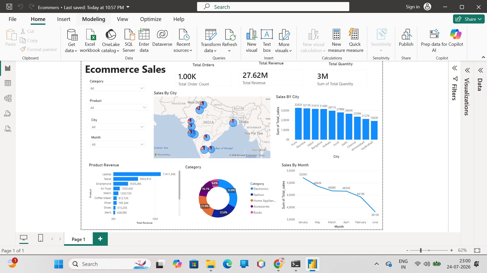

# 🛒 E-Commerce Sales Data Analysis using Python & Power BI

## 📌 Project Overview
This project demonstrates an end-to-end e-commerce sales analysis workflow using **Python (Jupyter Notebook)** for data cleaning, preprocessing, and exploratory data analysis (EDA), followed by **Power BI** for creating an interactive business intelligence dashboard.

The project transforms raw sales data into meaningful insights that help businesses understand sales performance, customer behavior, profitability, and product trends.

---

## 🎯 Objectives
- Clean and preprocess raw sales data.
- Handle missing values and duplicates.
- Perform exploratory data analysis (EDA).
- Analyze sales, profit, and customer trends.
- Build an interactive Power BI dashboard.
- Generate business insights for data-driven decision-making.

---

## 🛠️ Technologies Used
- Python
- Jupyter Notebook
- Pandas
- NumPy
- Matplotlib
- Power BI
- Power Query
- DAX
- Microsoft Excel / CSV

---

## 📂 Repository Structure

```text
Ecommerce-Sales-Analysis/
│── data/
│   ├── ecommerce_sales_1000_records.csv
│
│── notebooks/
│   ├── Ecommers.ipynb
│   
│
│── powerbi/
│   ├── Ecommerce.pbix
│
│── screenshots/
│   ├── Ecommerce_Dashboard.png
│
│── README.md
```

---

## 📊 Power BI Dashboard Features
- Sales Overview
- Profit Analysis
- Category-wise Sales
- Customer Analysis
- Regional Performance
- Monthly Sales Trend
- Top Products
- Interactive Filters & Slicers

---

## 🐍 Python Data Operations
The Jupyter Notebook includes:

- Data Import
- Data Cleaning
- Missing Value Treatment
- Duplicate Removal
- Data Type Conversion
- Feature Engineering
- Exploratory Data Analysis (EDA)
- Data Visualization
- Exporting Clean Data for Power BI

---

## 📈 Key Insights
- Identified top-performing products and categories.
- Analyzed monthly sales trends and seasonality.
- Evaluated regional sales performance.
- Compared revenue and profit across different segments.
- Generated actionable insights to support business decisions.

---

## 📷 Dashboard Preview



---

## 🚀 Future Improvements
- Sales Forecasting using Machine Learning
- Customer Segmentation
- Real-time Dashboard Integration
- SQL Database Connectivity

---

## 👩‍💻 Author
**Ashwini Dubhashi**

B.Tech (AI & Data Science)
